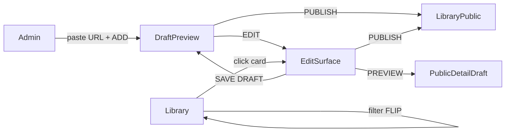

# ODDITY — Admin Profile (Curator Desk)

> Style DNA: [`DESIGN.md`](../../DESIGN.md)  
> Motion / tokens: [`ODDITY-design-system.md`](./ODDITY-design-system.md)  
> Поля карточки: [`ODDITY-content-model.md`](./ODDITY-content-model.md)  
> Макет: [`assets/oddity-09-admin-profile-white.png`](./assets/oddity-09-admin-profile-white.png)  
> Route (план): `/admin`

Админ-профиль — **не** Strapi panel и не dashboard.  
Это кураторский стол на белом холсте: вставить ссылку → получить draft-карточку → отредактировать по content model → выложить в public.

---

## 0. Принцип

Тот же визуальный язык, что у архива:

| Правило | Как на admin |
|---------|----------------|
| Белый холст | Фон всегда `--c-white` |
| Media = цвет | Постер/обложка без фильтров и overlay |
| Accent ≤ 5% | Acid green **только** на ADD / PUBLISH / active filter |
| Без UI-карточек | Media + подпись; без shadow / radius на media |
| Одна задача на секцию | Add → Preview → Library |

**Не делать:** sidebar dashboard, KPI-полоски, pill-фильтры, dark mode admin chrome.

---

## 1. Экран: Admin Profile (`/admin`)

### 1.1 Композиция (desktop 1440)

```
┌──────────────────────────────────────────────────────────┐
│  ODDITY                              ADMIN               │  header (как archive)
├──────────────────────────────────────────────────────────┤
│                                                          │
│  PROFILE                                                 │  typo-h1 uppercase
│  CURATOR · EST. 2026                                     │  typo-micro grey-400
│                                                          │
│  ─────────────────────────────────────────────────────   │  hairline --c-grey
│                                                          │
│  ADD TO ARCHIVE                                          │  typo-micro
│  [ Paste a link — Letterboxd, IMDb, Spotify… ]  ( ADD )  │  input + accent FAB
│                                                          │
│  ─────────────────────────────────────────────────────   │
│                                                          │
│  YOUR CARDS          ALL · DRAFT · PUBLIC                │  section + filters
│                      3 DRAFT · 12 PUBLIC                 │  typo-micro grey-400
│                                                          │
│  ┌──────────────┐  TITLE                                 │
│  │              │  TYPE · YEAR · COUNTRY                 │  ★ Draft preview
│  │   POSTER     │  Short description…                    │    (featured row)
│  │   DRAFT      │  EDIT          PUBLISH                 │
│  └──────────────┘                                        │
│                                                          │
│  [card]  [card]  [card]  [card]                          │  library grid
│                                                          │
└──────────────────────────────────────────────────────────┘
```

### 1.2 Hierarchy

1. **Brand / role** — `PROFILE` + kicker (не конкурирует с архивным display «ODDITY»).
2. **Add** — единственный primary CTA viewport’а (lime FAB).
3. **Draft preview** — featured row для последней добавленной / выбранной draft.
4. **Library** — остальные карточки куратора.

---

## 2. Секция: Add by link

### UI

| Элемент | Спека |
|---------|--------|
| Label | `ADD TO ARCHIVE` — `typo-micro`, `--c-grey-400` |
| Input | height 56, radius 8, fill `--c-grey-100`, placeholder `--c-grey-400` |
| Placeholder | `Paste a link — Letterboxd, IMDb, Spotify…` |
| Focus | 2px black border ring (как `DESIGN.md` → Inputs) |
| Submit | круглый FAB `--c-accent`, текст чёрный `typo-caption` bold: `ADD` |
| Cursor | `EXPLORE` на пустом поле → `OPEN` при валидной ссылке |

### Поведение

```
1. Paste URL → debounce 300ms validate
2. Submit (Enter / ADD)
3. Loading: input opacity 0.6, без skeleton — только fade
4. Success: новая карточка появляется как Draft preview (stagger 400ms)
5. Error: caption под инпутом `--c-grey-600`, без красных алертов
```

### Что создаётся

Минимальный **Draft** из content model (остальное — на Edit):

| Field | Источник |
|-------|----------|
| Title | parse / OG / ручной fallback |
| Type | детект по домену или выбор на Edit |
| Cover / Poster | OG image / placeholder `--c-grey-100` |
| Short description | OG description (опц.) |
| Availability | платформа из URL (если известна) |
| **Publish status** | `draft` |

Поля вне модели не добавлять. Incomplete draft — норма: пустые блоки на public detail не показываются (правило content model §3.1).

---

## 3. Publish status

Отдельное поле жизненного цикла карточки (не путать с Core `Status`: Released / Ongoing / Upcoming).

| Value | В admin | В публичном архиве |
|-------|---------|-------------------|
| `draft` | Видна куратору; маркер `DRAFT` | **Не** в gallery / search / collections |
| `public` | Маркер `PUBLIC` (grey) | Обычная archive card |

Переход только явный: **PUBLISH**. Снятие в draft — `UNPUBLISH` в Edit (вторичное действие, без accent).

---

## 4. Draft preview (featured)

Показывается, когда есть ≥1 draft **или** только что добавленная карточка.

### Layout

60/40 split (как Album page, но компактнее):

- **Left:** Cover / Poster, original colors, `aspect` из контента, **без** radius / shadow.
- **Right:** meta + actions.

### Meta (только Core + status)

```
DRAFT                         ← typo-micro, black (status)
MOVIE · 2017 · USA            ← typo-micro grey-400
BLADE RUNNER 2049             ← typo-h3 / typo-p1 bold uppercase
Short description…            ← typo-p2, max 3 lines
```

Маркер `DRAFT` — **editorial caption** над meta, не floating badge / chip поверх media.

### Actions

| Action | Визуал | Поведение |
|--------|--------|-----------|
| `EDIT` | text link, underline 0→100% | → Edit surface (§5) |
| `PUBLISH` | text + acid underline | draft → public; card уходит в library grid |

Hover poster: `scale(1.02)` как gallery. Cursor: `VIEW` / `OPEN`.

### Motion (вход после ADD)

1. `0–400ms` — poster `opacity 0→1`, `translateY 24→0`
2. `200–500ms` — title + meta stagger 50ms
3. `400–600ms` — actions fade in

Easing: `--ease-out-expo`.

---

## 5. Edit surface

Не modal поверх галереи — **отдельный экран** `/admin/cards/[id]` (или split-panel на desktop ≥1280).

Сохраняет white canvas; форма группируется **строго по content model**:

| Block | Поля |
|-------|------|
| Core | Title, Original title, Type, Year, Country, Runtime…, Status (Released…), Cover, Hero, Short / Full description |
| People | роли по Type |
| Categories | Genres · Themes · Atmosphere · Mood · Tags |
| Oddity / Meme | characteristics |
| Visual DNA | бары |
| Quality | Craftsmanship… |
| Visual Spectrum | оси (ссылка на spectrum compare — later) |
| Availability | платформы / ссылки |
| Media | gallery, trailer… |
| Facts | trivia… |
| Relationships | тип связи + target |
| Collections | membership |
| Editor's Note | italic + lime marker при фокусе |
| Timeline | chronology… |

### Chrome Edit

```
[← BACK]     DRAFT / PUBLIC          [SAVE DRAFT]  [PUBLISH]
```

- `SAVE DRAFT` — text / caption, без fill.
- `PUBLISH` — accent FAB или text + lime underline (один accent CTA).
- Sticky bottom bar на mobile.

### Preview

Кнопка `PREVIEW` → draft mode публичной detail page (см. `docs/07-strapi-preview.md`), не отдельный «admin look».

---

## 6. Library grid

Список карточек куратора под featured preview.

### Filters

Горизонтальные теги (как gallery filters), не dropdown:

`ALL` · `DRAFT` · `PUBLIC`

Active: underline acid green `width 0→100%` / 300ms.  
Счётчики: `typo-micro` grey-400 справа.

FLIP rearrange при смене фильтра — как gallery (§2.2 design-system).

### Card cell

Та же сущность, что archive `CollectionCard`, плюс status caption:

```
[media original colors]
DRAFT | PUBLIC          ← typo-micro
type / artist           ← typo-micro bold
title                   ← typo-p2
year                    ← typo-p2 grey-400
```

Draft media: **не** grayscale. Допустимо `opacity 0.92` в покое, на hover → `1` + scale 1.02.

Click → Edit (не публичный FLIP detail).  
Cursor: `EDIT` (новое состояние) или `OPEN`.

### Empty states

| Состояние | UI |
|-----------|-----|
| Нет карточек | Только Add-секция; подпись `Paste a link to start the archive.` |
| Нет draft при фильтре DRAFT | `No drafts.` micro grey — без иллюстраций |
| Нет public | `Nothing published yet.` |

---

## 7. Cursor (дополнение к системе)

| Состояние | Контекст |
|-----------|----------|
| `EXPLORE` | пустой URL input |
| `OPEN` | валидный URL / FAB ADD |
| `EDIT` | hover library card / EDIT link |
| `VIEW` | hover draft poster (preview) |
| `READ` | длинные form fields |

Визуал `EDIT`: текст EDIT, acid green, scale 0→1 / 200ms spring — по аналогии с VIEW.

---

## 8. Motion map



| Transition | Duration | Easing |
|------------|----------|--------|
| ADD → Draft preview appear | 400–600ms | expo-out |
| Filter library | 500ms FLIP | expo-out |
| PUBLISH (draft leaves featured) | 400ms fade + grid insert | ease-in-out |
| Admin → Edit | crossfade / slide 400ms | ease-in-out |
| Preview → public detail | existing draft-mode | — |

---

## 9. Responsive

| Breakpoint | Изменения |
|------------|-----------|
| Desktop 1440+ | Featured 60/40, library 4 col |
| Tablet 768 | Featured stack (poster → meta), library 2 col, FAB ADD рядом с input |
| Mobile 375 | 1 col; input full-width, FAB under; sticky `PUBLISH` в Edit |

---

## 10. Компоненты (план реализации)

| UI | Слой FSD |
|----|----------|
| Admin page shell | `_pages/admin/ui` |
| URL add field | `features/add-archive-link` (или `_pages/admin/ui`) |
| Draft preview block | `_pages/admin/ui` + `entities/*-card` |
| Library grid | reuse gallery patterns / `entities/collection-card` + status |
| Edit form blocks | `_pages/admin-edit/ui` по секциям content model |
| Publish / draft actions | `features/publish-card` |
| Route | `pages/admin/index.tsx`, `pages/admin/cards/[id].tsx` |

Импорты только вниз по FSD. Публичная gallery **не** импортирует admin features.

---

## 11. Чеклист приёмки

- [ ] Белый холст, Helvetica Neue / `typo-*`, токены `--c-*`
- [ ] Accent только на ADD / PUBLISH / active filter
- [ ] Input ссылки + создание draft с минимальным Core
- [ ] Featured draft preview: poster + EDIT + PUBLISH
- [ ] Library с фильтрами ALL / DRAFT / PUBLIC
- [ ] Edit группирует поля **только** из content model
- [ ] `public` → видно в архиве; `draft` → скрыто
- [ ] Нет shadow / grayscale media / dashboard chrome
