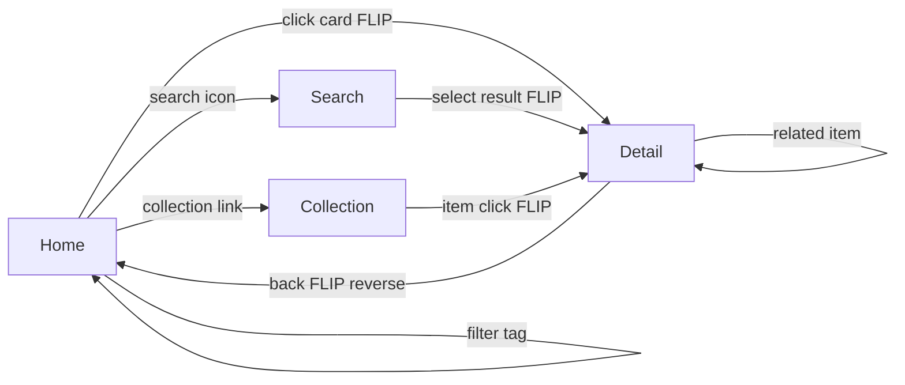

# ODDITY — Design System & Motion Spec

> Визуальные макеты: `assets/oddity-*-white.png`

---

## 0. Принцип: белый холст

**Белый — основа.** Чёрный — типографика и UI поверх. Изображения — в **оригинальных цветах**, без фильтров, без затемнения, без монохромных overlay.

Белый фон работает как галерейная стена: контент (постеры, обложки, кадры) — главный носитель цвета. Чёрный текст и acid green accent не конкурируют с изображениями, а обрамляют их как подписи в музейном каталоге.

Чёрный фон используется **только** как редкое исключение: fullscreen video player, ночной режим (опционально), preloader.

---

## 1. Design Tokens

### Цвета

| Token | Value | Использование |
|-------|-------|---------------|
| `--c-white` | `#FFFFFF` | **Основной фон** — 90%+ интерфейса |
| `--c-black` | `#000000` | Типографика, навигация, UI-элементы |
| `--c-grey-100` | `#F5F5F5` | Hover-состояния, subtle dividers |
| `--c-grey-400` | `#8A8A8A` | Метаданные, placeholder |
| `--c-grey-600` | `#454545` | Вторичный текст, неактивные теги |
| `--c-accent` | `#BFFF00` | Acid green — **только** интерактив |

**Правило:** accent ≤ 5% площади экрана.

**Правило для изображений:** никаких `grayscale`, `mix-blend-mode`, color overlay поверх media. Карточки без тёмных gradient-ов снизу.

### Типографика

Паттерн как в Rakurs: миксины = source of truth, глобальные классы `.typo-*` для JSX, в CSS Modules — `@include`.

| Класс | Роль | Desktop | LH | Tracking |
|-------|------|---------|-----|----------|
| `typo-display` | Hero / бренд | ~120 | 0.85 | −0.04em |
| `typo-h1` | Заголовок страницы | ~56 | 0.92 | −0.03em |
| `typo-h2` | Секция | ~40 | 1 | −0.02em |
| `typo-h3` | Карточка / подзаголовок | ~28 | 1.1 | −0.02em |
| `typo-p1` | Лид | ~18 | 1.4 | −0.01em |
| `typo-p2` | Текст | ~16 | 1.5 | 0 |
| `typo-caption` | Nav / UI | ~12 | 1 | +0.08em + uppercase |
| `typo-micro` | Meta / kicker / tags | ~11 | 1.2 | +0.1em + uppercase |

Шрифт: Helvetica Neue / system. Weight и цвет — снаружи (`font-weight`, `--c-*`).

```tsx
<h1 className={clsx(s.title, "typo-h1")}>{title}</h1>
```


### Spacing

Базовая сетка: **8px**. Крупные отступы: 64, 96, 128, 192px.

### Easing

```
--ease-out-expo: cubic-bezier(0.16, 1, 0.3, 1)
--ease-in-out:   cubic-bezier(0.65, 0, 0.35, 1)
--ease-spring:   cubic-bezier(0.34, 1.56, 0.64, 1)  // только cursor
```

### Duration

| Тип | ms |
|-----|-----|
| Micro (hover) | 200 |
| Standard | 400 |
| Page transition | 600–800 |
| Typography stagger | 50ms между строками |
| Filter rearrange | 500 |

---

## 2. Экраны

### 2.1 Home / Gallery (`oddity-01-home-gallery-white.png`)

**Композиция:** Белый холст. Чёрная hero-типографика ODDITY + masonry из **цветных** оригиналов.

**Анимация входа:**
1. `0ms` — белый экран
2. `0–400ms` — логотип ODDITY (чёрный): `opacity 0→1`, `translateY 24px→0`
3. `200–600ms` — метаданные `EST. 2026` fade in (grey-400)
4. `400–1200ms` — карточки stagger: `opacity 0→1`, `translateY 40px→0`, delay `index * 60ms`. Изображения появляются в полной насыщенности с первого кадра.

**Hover карточки:** `scale(1.02)`, соседние `opacity 0.85` (не слишком сильно — цвета должны оставаться видимыми), cursor → `VIEW`

---

### 2.2 Gallery + Filters (`oddity-02-gallery-filters-white.png`)

**Фильтры:** горизонтальные теги, не dropdown.

**Активный тег:** underline acid green, `width 0→100%` за 300ms.

**Смена фильтра (FLIP masonry):**
```
1. First  — запомнить позиции всех карточек (getBoundingClientRect)
2. Last   — применить новый набор, скрыть несовпадающие (display:none / visibility)
3. Invert — вычислить delta позиций
4. Play   — animate transform + opacity
```
- Несовпадающие: `opacity 1→0`, `scale 0.95`, 300ms
- Остающиеся: FLIP translate, 500ms `--ease-out-expo`
- Новые: `opacity 0→1`, `translateY 20px→0`, stagger 40ms

**Порядок:** сначала уходят, потом rearrange, потом приходят новые.

---

### 2.3 FLIP Card → Detail (`oddity-03-flip-transition-white.png`)

**Главная анимация проекта.** Не modal — физическое превращение карточки в страницу.

#### Открытие (600–800ms total)

| Phase | Time | Действие |
|-------|------|----------|
| T0 | 0ms | Click на карточку |
| T1 | 0–100ms | Остальные карточки `opacity → 0.25` (белый фон просвечивает, цвета приглушаются мягко, без blur) |
| T2 | 0–600ms | Выбранная карточка FLIP: rect gallery → rect hero |
| T3 | 300–600ms | Фон страницы fade in (если нужен overlay) |
| T4 | 500–800ms | Типографика: headline `opacity 0→1`, `translateY 16px→0` |
| T5 | 600–900ms | Метаданные stagger по строкам, 50ms delay |

**FLIP implementation:**
```js
// pseudo
const first = card.getBoundingClientRect()
// navigate / change layout
const last = hero.getBoundingClientRect()
const dx = first.left - last.left
const dy = first.top - last.top
const sx = first.width / last.width
const sy = first.height / last.height

hero.style.transform = `translate(${dx}px,${dy}px) scale(${sx},${sy})`
requestAnimationFrame(() => {
  hero.style.transition = 'transform 600ms cubic-bezier(0.16,1,0.3,1)'
  hero.style.transform = 'none'
})
```

#### Закрытие (reverse)

1. Типографика fade out (200ms)
2. Hero FLIP обратно в позицию карточки (600ms)
3. Остальные карточки `opacity 0.25→1` (400ms, delay 200ms)

**Cursor:** `OPEN` → `VIEW` при hover, `OPEN` при click.

---

### 2.4 Album Page (`oddity-04-album-page-white.png`)

**Layout:** 60/40 split — artwork слева, типографика справа.

**Вход (после FLIP):**
- Artwork уже на месте (из FLIP)
- Headline: split-text, каждое слово stagger 80ms
- Meta grid: fade in снизу, 400ms

**Scroll:**
- Artwork: subtle parallax `translateY(scroll * 0.15)`
- Related strip: horizontal scroll, inertia

**Links (LISTEN, RELATED):** acid green, underline on hover `width 0→100%`

---

### 2.5 Movie Page (`oddity-05-movie-page-white.png`)

**Отличие от Album:** cinematic hero 2.35:1, full-width.

**Hero parallax:** `translateY(scroll * 0.2)`, max 80px.

**Credits sidebar:** slide in from left при scroll trigger (IntersectionObserver), 400ms.

**Cursor на hero:** `PLAY`

---

### 2.6 Collection Page (`oddity-06-collection-page-white.png`)

**Композиция:** editorial spread — заголовок перекрывает коллаж.

**Вход:**
1. Заголовок `clip-path: inset(0 100% 0 0)` → `inset(0)`, 800ms
2. Изображения коллажа stagger scale `0.9→1`, 60ms delay
3. Grid items — masonry FLIP из случайных позиций (эффект «сборки экспозиции»)

---

### 2.7 Search (`oddity-07-search-white.png`)

**Открытие:** overlay `opacity 0→1`, search line expand `scaleX 0→1` от центра, 400ms.

**Ввод:** результаты появляются с debounce 300ms, stagger 40ms.

**Закрытие:** reverse, Escape key.

**Cursor:** `READ` на результатах, `EXPLORE` на пустом поле.

---

## 3. Cursor System (`oddity-08-cursor-system-white.png`)

| Состояние | Контекст | Визуал | Анимация |
|-----------|----------|--------|----------|
| Default | везде | точка 6px black | follow с lerp 0.15 |
| VIEW | hover gallery card | текст VIEW, acid green | scale 0→1, 200ms spring |
| OPEN | click ready | VIEW + ring expand | ring `scale 1→1.5`, opacity 1→0 |
| PLAY | video/film hero | PLAY + ▶ | pulse 2s infinite |
| LISTEN | audio link | LISTEN + 3 dots | dots wave stagger |
| READ | search result, article | READ | fade in |
| EXPLORE | home hero, empty areas | EXPLORE + crosshair | rotate 0→90° on move |

**Технически:** отдельный DOM layer, `position: fixed`, `pointer-events: none`, GSAP или RAF lerp.

---

## 4. Navigation

**Поведение:** почти невидимая чёрная навигация на белом. `opacity 0.5` в покое, `1` при hover зоны top 80px.

**Структура:**
```
[ODDITY]          Music  Movies  TV  Art  ...          [Search]
```

**Scroll:** nav `translateY(0→-100%)` после 120px scroll, появляется при hover top.

**Mobile:** hamburger → full-screen overlay, пункты stagger fade in.

---

## 5. Footer

Минимальный. Одна строка:
```
© ODDITY — Digital Archive    About    Contact    Instagram
```
`opacity 0.4`, при hover ссылок → acid green.

---

## 6. Карта переходов



### Матрица переходов

| From → To | Тип | Duration | Easing |
|-----------|-----|----------|--------|
| Gallery → Detail | FLIP + fade others | 700ms | expo-out |
| Detail → Gallery | FLIP reverse | 700ms | expo-out |
| Gallery → Gallery (filter) | Masonry FLIP | 500ms | expo-out |
| Any → Search | Overlay fade | 400ms | ease-in-out |
| Search → Detail | FLIP from result row | 700ms | expo-out |
| Page → Page (related) | Crossfade hero + text stagger | 500ms | ease-in-out |
| Collection → Detail | FLIP | 700ms | expo-out |

---

## 7. Motion Intensity: 6/10

**Делаем:**
- FLIP для пространственной связи
- Stagger typography
- Subtle parallax (≤20% scroll)
- Hover scale ≤ 1.02

**Не делаем:**
- Bounce / elastic на layout
- 3D rotate карточек
- Particle effects
- Автоплей видео в галерее
- Skeleton loaders (только fade)

---

## 8. Responsive

| Breakpoint | Изменения |
|------------|-----------|
| Desktop 1440+ | Полный editorial layout |
| Tablet 768 | 50/50 split → stack, masonry 2 col |
| Mobile 375 | 1 col, hero full-width, nav overlay |

**FLIP на mobile:** тот же принцип, hero = full viewport width.

---

## 9. Компоненты — чеклист

- [x] Gallery (masonry + FLIP source)
- [x] Album page
- [x] Movie page
- [x] Collection page
- [x] Search overlay
- [x] Filter tags
- [x] Hero section
- [x] Navigation
- [x] Footer
- [x] Sidebar metadata
- [x] Related content strip
- [x] Image viewer (встроен в FLIP hero, pinch-zoom на mobile)
- [x] Custom cursor

---

## 10. Файлы макетов

| Файл | Экран |
|------|-------|
| `oddity-01-home-gallery-white.png` | Home + Gallery |
| `oddity-02-gallery-filters-white.png` | Gallery + Filters |
| `oddity-03-flip-transition-white.png` | FLIP Transition storyboard |
| `oddity-04-album-page-white.png` | Album Detail |
| `oddity-05-movie-page-white.png` | Movie Detail |
| `oddity-06-collection-page-white.png` | Collection |
| `oddity-07-search-white.png` | Search |
| `oddity-08-cursor-system-white.png` | Cursor States |
